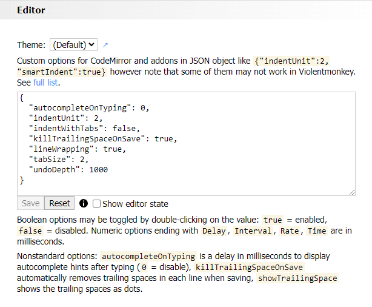
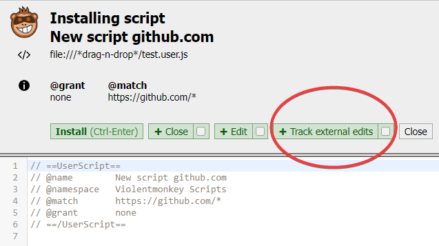

For anyone who uses Violentmonkey, it is easy to find a way to edit a script like this:

However, it is really hard to make everyone love it. *A* probably likes a theme of `monokai`, while *B* prefers `eclipse`. *C* might use 2 spaces for indentation while *D* prefers tabs.

It is impossible to satisfy every single user. Lots of configurations may be added for this, but are they really worth it? A user would have to face lots of choices before he could use it just as a script manager, or have to look for a simple option among lots of unrelated editor options. What is worse, the browser may inhibit some shortcuts or operations that a local editor can have. In other words, an editor inside Violentmonkey will never be as good as your favorite one.

Here comes the question: How to edit my script with my favorite editor?

Save to a file
---

First, copy the script to your favorite editor and save it to a file.

VIM is my favorite editor, and the script is saved at `D:/Source/vm-script.user.js`. Note that the script file must have a name ending with `.user.js`, otherwise won't be recognized by Violentmonkey.

Install a local script
---

First make sure the local script is named with a suffix of `.user.js`.

Then use one of these methods:

- Drag the file into any Violentmonkey tab or popup.

  Requires Chrome/Chromium 86+ and Violentmonkey 2.16+.

- Drag the file into the browser toolbar or tab label area.

  * In Chrome-like browsers you must enable *"Allow access to file URLs"* in Violentmonkey's details in `chrome://extensions` page first. Since this is dangerous (any userscript will be able to read any local file via GM_xmlhttpRequest), you may want to use the other methods instead.

  * In modern Firefox-like browsers don't close the file tab while tracking as it's used to read the contents of the file.

- Set up a server and navigate to `http://localhost:8080/my-script.user.js`.

  The port number `:8080` may be different or even omitted depending on the server you installed.

  We recommend [indexzero/http-server](https://github.com/indexzero/http-server#readme). Once you install it, just type `http-server -c5` at the directory of your script to start a server. The `-c5` option sets cache time for max-age header to 5 seconds ([more info](https://github.com/violentmonkey/violentmonkey/issues/460#issuecomment-434335758)), thus forcing a browser to query the server URL every 5 seconds. The caching can be disabled with `-c-1` option.  

  Make sure the hostname is `localhost` and the script name ends with `.user.js`.

Click `Track external edits` button to confirm installation. You can also make it the default button for local files by ticking the checkbox on the right.

Edit and sync
---

After installation, the confirmation page will keep watching the file before the page is closed. Once the file is changed, the new version will be installed automatically. As a result, you edit the script in your favorite editor, and the changes are synced to Violentmonkey immediately.

Known issues
---
- The older the file is, the more seldom a browser will query it. See [this Violentmonkey's issue](https://github.com/violentmonkey/violentmonkey/issues/460#issuecomment-434335758).
